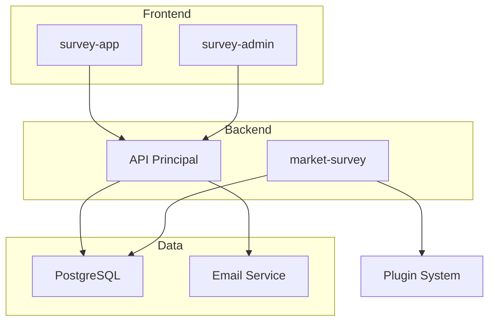

# 🛠️ Guia de Desenvolvimento - Voxer Studio

Este guia fornece informações detalhadas para desenvolvedores que desejam contribuir ou estender o Voxer Studio.

## 📋 Índice

- [Arquitetura do Sistema](#-arquitetura-do-sistema)
- [Estrutura de Código](#-estrutura-de-código)
- [Padrões de Desenvolvimento](#-padrões-de-desenvolvimento)
- [Workflow de Desenvolvimento](#-workflow-de-desenvolvimento)
- [Testes](#-testes)
- [Debugging](#-debugging)
- [Extensibilidade](#-extensibilidade)
- [Performance](#-performance)

## 🏗️ Arquitetura do Sistema

### Visão Geral

O Voxer Studio segue uma arquitetura de **microserviços** com **monorepo**, proporcionando:

- **Separação de responsabilidades**
- **Escalabilidade independente**
- **Reutilização de código**
- **Desenvolvimento paralelo**

### Componentes Principais



### Fluxo de Dados

1. **Frontend** → GraphQL → **Backend**
2. **Backend** → TypeORM → **PostgreSQL**
3. **Plugins** → HTTP → **API Principal**
4. **Email** → SMTP → **Provedor**

## 📁 Estrutura de Código

### Convenções de Nomenclatura

```typescript
// Arquivos
kebab-case.component.ts
kebab-case.service.ts
kebab-case.module.ts

// Classes
PascalCase
export class SurveyService {}

// Métodos e variáveis
camelCase
const surveyData = {};
async createSurvey() {}

// Constantes
UPPER_SNAKE_CASE
const API_BASE_URL = '';

// Interfaces
PascalCase com 'I' prefix (opcional)
interface ISurveyTemplate {}
interface SurveyTemplate {} // Preferido
```

### Estrutura de Módulos (NestJS)

```typescript
// survey.module.ts
@Module({
  imports: [
    TypeOrmModule.forFeature([Survey, SurveyResponse]),
    EmailModule,
  ],
  providers: [SurveyService, SurveyResolver],
  controllers: [SurveyController],
  exports: [SurveyService],
})
export class SurveyModule {}
```

### Estrutura de Componentes (Angular)

```typescript
// survey-list.component.ts
@Component({
  selector: 'app-survey-list',
  standalone: true,
  imports: [CommonModule, TranslateModule],
  templateUrl: './survey-list.component.html',
  styleUrls: ['./survey-list.component.scss']
})
export class SurveyListComponent implements OnInit {
  // Propriedades públicas primeiro
  surveys: Survey[] = [];
  loading = false;
  
  // Propriedades privadas
  private destroy$ = new Subject<void>();
  
  constructor(
    private surveyService: SurveyService,
    private router: Router
  ) {}
  
  ngOnInit() {
    this.loadSurveys();
  }
  
  ngOnDestroy() {
    this.destroy$.next();
    this.destroy$.complete();
  }
  
  // Métodos públicos
  async loadSurveys() {}
  
  onSurveyClick(survey: Survey) {}
  
  // Métodos privados
  private handleError(error: any) {}
}
```

## 🎯 Padrões de Desenvolvimento

### Backend (NestJS)

#### 1. Injeção de Dependência

```typescript
@Injectable()
export class SurveyService {
  constructor(
    @InjectRepository(Survey)
    private surveyRepository: Repository<Survey>,
    private emailService: EmailService,
    private logger: Logger,
  ) {}
}
```

#### 2. Tratamento de Erros

```typescript
@Catch(HttpException)
export class HttpExceptionFilter implements ExceptionFilter {
  catch(exception: HttpException, host: ArgumentsHost) {
    const ctx = host.switchToHttp();
    const response = ctx.getResponse();
    const status = exception.getStatus();
    
    response.status(status).json({
      statusCode: status,
      timestamp: new Date().toISOString(),
      message: exception.message,
    });
  }
}
```

#### 3. Validação com DTOs

```typescript
export class CreateSurveyDto {
  @IsString()
  @IsNotEmpty()
  @MaxLength(200)
  title: string;
  
  @IsString()
  @IsOptional()
  @MaxLength(1000)
  description?: string;
  
  @IsObject()
  @ValidateNested()
  @Type(() => SurveySchema)
  schema: SurveySchema;
}
```

#### 4. GraphQL Resolvers

```typescript
@Resolver(() => Survey)
export class SurveyResolver {
  constructor(private surveyService: SurveyService) {}
  
  @Query(() => [Survey])
  @UseGuards(JwtAuthGuard)
  async surveys(): Promise<Survey[]> {
    return this.surveyService.findAll();
  }
  
  @Mutation(() => Survey)
  @UseGuards(JwtAuthGuard, AdminGuard)
  async createSurvey(
    @Args('input') input: CreateSurveyInput,
    @CurrentUser() user: User,
  ): Promise<Survey> {
    return this.surveyService.create(input, user);
  }
  
  @ResolveField(() => [SurveyResponse])
  async responses(@Parent() survey: Survey): Promise<SurveyResponse[]> {
    return this.surveyService.getResponses(survey.id);
  }
}
```

### Frontend (Angular)

#### 1. Serviços com Apollo

```typescript
@Injectable({
  providedIn: 'root'
})
export class SurveyService {
  constructor(private apollo: Apollo) {}
  
  getSurveys(): Observable<Survey[]> {
    return this.apollo.query<{ surveys: Survey[] }>({
      query: GET_SURVEYS_QUERY,
      errorPolicy: 'all',
    }).pipe(
      map(result => result.data.surveys),
      catchError(this.handleError)
    );
  }
  
  createSurvey(input: CreateSurveyInput): Observable<Survey> {
    return this.apollo.mutate<{ createSurvey: Survey }>({
      mutation: CREATE_SURVEY_MUTATION,
      variables: { input },
      update: (cache, { data }) => {
        // Atualizar cache Apollo
        const existingData = cache.readQuery<{ surveys: Survey[] }>({
          query: GET_SURVEYS_QUERY
        });
        
        if (existingData && data) {
          cache.writeQuery({
            query: GET_SURVEYS_QUERY,
            data: {
              surveys: [...existingData.surveys, data.createSurvey]
            }
          });
        }
      }
    }).pipe(
      map(result => result.data!.createSurvey),
      catchError(this.handleError)
    );
  }
  
  private handleError(error: any): Observable<never> {
    console.error('Survey service error:', error);
    return throwError(() => new Error('Erro ao processar solicitação'));
  }
}
```

#### 2. Componentes Reativos

```typescript
export class SurveyFormComponent implements OnInit {
  surveyForm: FormGroup;
  loading$ = new BehaviorSubject<boolean>(false);
  error$ = new BehaviorSubject<string | null>(null);
  
  constructor(
    private fb: FormBuilder,
    private surveyService: SurveyService,
    private router: Router
  ) {
    this.surveyForm = this.createForm();
  }
  
  ngOnInit() {
    this.setupFormValidation();
  }
  
  private createForm(): FormGroup {
    return this.fb.group({
      title: ['', [Validators.required, Validators.maxLength(200)]],
      description: ['', Validators.maxLength(1000)],
      fields: this.fb.array([])
    });
  }
  
  private setupFormValidation() {
    this.surveyForm.statusChanges.pipe(
      debounceTime(300),
      distinctUntilChanged(),
      takeUntilDestroyed()
    ).subscribe(status => {
      // Lógica de validação em tempo real
    });
  }
  
  async onSubmit() {
    if (this.surveyForm.invalid) return;
    
    this.loading$.next(true);
    this.error$.next(null);
    
    try {
      const survey = await firstValueFrom(
        this.surveyService.createSurvey(this.surveyForm.value)
      );
      
      await this.router.navigate(['/surveys', survey.id]);
    } catch (error) {
      this.error$.next('Erro ao criar pesquisa');
    } finally {
      this.loading$.next(false);
    }
  }
}
```

## 🔄 Workflow de Desenvolvimento

### 1. Configuração do Ambiente

```bash
# Clone e setup inicial
git clone <repo>
cd voxer
pnpm install
cp .env.example .env

# Configurar hooks de git
pnpm prepare
```

### 2. Criação de Features

```bash
# Criar branch para feature
git checkout -b feature/nova-funcionalidade

# Desenvolvimento
pnpm api:dev    # Terminal 1
pnpm survey-app:dev  # Terminal 2

# Testes durante desenvolvimento
pnpm test:watch
```

### 3. Commits e Pull Requests

```bash
# Commits seguindo Conventional Commits
git commit -m "feat(survey): adiciona validação de schema"
git commit -m "fix(auth): corrige refresh token"
git commit -m "docs(api): atualiza documentação GraphQL"

# Push e PR
git push origin feature/nova-funcionalidade
# Criar PR no GitHub
```

### 4. Code Review

#### Checklist para Reviewers

- [ ] Código segue padrões estabelecidos
- [ ] Testes adequados incluídos
- [ ] Documentação atualizada
- [ ] Performance considerada
- [ ] Segurança verificada
- [ ] Acessibilidade (frontend)
- [ ] Responsividade (frontend)

## 🧪 Testes

### Estrutura de Testes

```
src/
├── modules/
│   └── survey/
│       ├── survey.service.ts
│       ├── survey.service.spec.ts
│       ├── survey.resolver.ts
│       └── survey.resolver.spec.ts
└── test/
    ├── unit/
    ├── integration/
    └── e2e/
```

### Testes Unitários (Backend)

```typescript
describe('SurveyService', () => {
  let service: SurveyService;
  let repository: Repository<Survey>;
  
  beforeEach(async () => {
    const module = await Test.createTestingModule({
      providers: [
        SurveyService,
        {
          provide: getRepositoryToken(Survey),
          useClass: Repository,
        },
      ],
    }).compile();
    
    service = module.get<SurveyService>(SurveyService);
    repository = module.get<Repository<Survey>>(getRepositoryToken(Survey));
  });
  
  describe('create', () => {
    it('should create a survey successfully', async () => {
      // Arrange
      const input = { title: 'Test Survey', schema: {} };
      const expectedSurvey = { id: '1', ...input };
      
      jest.spyOn(repository, 'save').mockResolvedValue(expectedSurvey as Survey);
      
      // Act
      const result = await service.create(input);
      
      // Assert
      expect(result).toEqual(expectedSurvey);
      expect(repository.save).toHaveBeenCalledWith(
        expect.objectContaining(input)
      );
    });
  });
});
```

### Testes de Integração (Frontend)

```typescript
describe('SurveyListComponent', () => {
  let component: SurveyListComponent;
  let fixture: ComponentFixture<SurveyListComponent>;
  let surveyService: jasmine.SpyObj<SurveyService>;
  
  beforeEach(async () => {
    const spy = jasmine.createSpyObj('SurveyService', ['getSurveys']);
    
    await TestBed.configureTestingModule({
      imports: [SurveyListComponent],
      providers: [
        { provide: SurveyService, useValue: spy }
      ]
    }).compileComponents();
    
    fixture = TestBed.createComponent(SurveyListComponent);
    component = fixture.componentInstance;
    surveyService = TestBed.inject(SurveyService) as jasmine.SpyObj<SurveyService>;
  });
  
  it('should load surveys on init', fakeAsync(() => {
    // Arrange
    const mockSurveys = [{ id: '1', title: 'Test' }];
    surveyService.getSurveys.and.returnValue(of(mockSurveys));
    
    // Act
    component.ngOnInit();
    tick();
    
    // Assert
    expect(component.surveys).toEqual(mockSurveys);
    expect(surveyService.getSurveys).toHaveBeenCalled();
  }));
});
```

### Comandos de Teste

```bash
# Todos os testes
pnpm test

# Testes específicos
pnpm test survey.service
pnpm test --testPathPattern=auth

# Testes com coverage
pnpm test:cov

# Testes e2e
pnpm test:e2e

# Testes em modo watch
pnpm test:watch
```

## 🐛 Debugging

### Backend (NestJS)

#### 1. Configuração do VS Code

```json
// .vscode/launch.json
{
  "version": "0.2.0",
  "configurations": [
    {
      "name": "Debug API",
      "type": "node",
      "request": "launch",
      "program": "${workspaceFolder}/apps/api/src/main.ts",
      "outFiles": ["${workspaceFolder}/dist/**/*.js"],
      "env": {
        "NODE_ENV": "development"
      },
      "runtimeArgs": ["-r", "ts-node/register"],
      "sourceMaps": true
    }
  ]
}
```

#### 2. Logs Estruturados

```typescript
@Injectable()
export class SurveyService {
  private readonly logger = new Logger(SurveyService.name);
  
  async create(input: CreateSurveyInput): Promise<Survey> {
    this.logger.log(`Creating survey: ${input.title}`);
    
    try {
      const survey = await this.repository.save(input);
      this.logger.log(`Survey created successfully: ${survey.id}`);
      return survey;
    } catch (error) {
      this.logger.error(`Failed to create survey: ${error.message}`, error.stack);
      throw error;
    }
  }
}
```

### Frontend (Angular)

#### 1. Redux DevTools

```typescript
// Para Apollo Client
import { APOLLO_OPTIONS } from 'apollo-angular';

@NgModule({
  providers: [
    {
      provide: APOLLO_OPTIONS,
      useFactory: () => ({
        cache: new InMemoryCache(),
        uri: 'http://localhost:3001/graphql',
        connectToDevTools: true, // Habilita Apollo DevTools
      }),
    },
  ],
})
export class GraphQLModule {}
```

#### 2. Debugging Reativo

```typescript
export class SurveyComponent {
  surveys$ = this.surveyService.getSurveys().pipe(
    tap(surveys => console.log('Surveys loaded:', surveys)),
    catchError(error => {
      console.error('Error loading surveys:', error);
      return of([]);
    })
  );
}
```

## 🔧 Extensibilidade

### Criando Novos Módulos

#### 1. Backend Module

```bash
# Gerar módulo
nest g module analytics
nest g service analytics
nest g resolver analytics
```

```typescript
// analytics.module.ts
@Module({
  imports: [
    TypeOrmModule.forFeature([AnalyticsEvent]),
  ],
  providers: [AnalyticsService, AnalyticsResolver],
  exports: [AnalyticsService],
})
export class AnalyticsModule {}
```

#### 2. Frontend Feature

```bash
# Criar estrutura
mkdir -p src/app/features/analytics
cd src/app/features/analytics

# Criar arquivos
touch analytics.service.ts
touch analytics.component.ts
touch analytics.routes.ts
```

### Sistema de Plugins

#### 1. Criando um Plugin

```javascript
// plugins/meu-plugin/package.json
{
  "name": "meu-plugin",
  "version": "1.0.0",
  "voxer": {
    "type": "webhook",
    "triggers": ["survey_submitted"],
    "config": {
      "url": "https://api.exemplo.com/webhook",
      "method": "POST",
      "headers": {
        "Authorization": "Bearer token"
      }
    }
  }
}

// plugins/meu-plugin/index.js
module.exports = {
  async execute(data, config) {
    const response = await fetch(config.url, {
      method: config.method,
      headers: {
        'Content-Type': 'application/json',
        ...config.headers
      },
      body: JSON.stringify(data)
    });
    
    return {
      success: response.ok,
      status: response.status,
      data: await response.json()
    };
  }
};
```

#### 2. Registrando Plugin

```typescript
// No PluginManagerService
async loadPlugin(pluginPath: string) {
  const packageJson = require(`${pluginPath}/package.json`);
  const plugin = require(pluginPath);
  
  this.plugins.set(packageJson.name, {
    metadata: packageJson.voxer,
    execute: plugin.execute
  });
}
```

## ⚡ Performance

### Backend Otimizações

#### 1. Database Queries

```typescript
// Evitar N+1 queries
@Entity()
export class Survey {
  @OneToMany(() => SurveyResponse, response => response.survey)
  responses: SurveyResponse[];
}

// Usar eager loading quando necessário
const surveys = await this.repository.find({
  relations: ['responses'],
  where: { isActive: true }
});

// Ou usar query builder para controle fino
const surveys = await this.repository
  .createQueryBuilder('survey')
  .leftJoinAndSelect('survey.responses', 'response')
  .where('survey.isActive = :isActive', { isActive: true })
  .getMany();
```

#### 2. Caching

```typescript
@Injectable()
export class SurveyService {
  @Cacheable('surveys', 300) // Cache por 5 minutos
  async findAll(): Promise<Survey[]> {
    return this.repository.find();
  }
}
```

### Frontend Otimizações

#### 1. OnPush Strategy

```typescript
@Component({
  selector: 'app-survey-list',
  changeDetection: ChangeDetectionStrategy.OnPush,
  template: `
    <div *ngFor="let survey of surveys$ | async; trackBy: trackBySurveyId">
      {{ survey.title }}
    </div>
  `
})
export class SurveyListComponent {
  surveys$ = this.surveyService.getSurveys();
  
  trackBySurveyId(index: number, survey: Survey): string {
    return survey.id;
  }
}
```

#### 2. Lazy Loading

```typescript
// app.routes.ts
export const routes: Routes = [
  {
    path: 'surveys',
    loadComponent: () => import('./features/surveys/survey-list.component')
      .then(m => m.SurveyListComponent)
  },
  {
    path: 'admin',
    loadChildren: () => import('./features/admin/admin.routes')
      .then(m => m.adminRoutes)
  }
];
```

---

**Próximo**: [Documentação da API](API.md)

